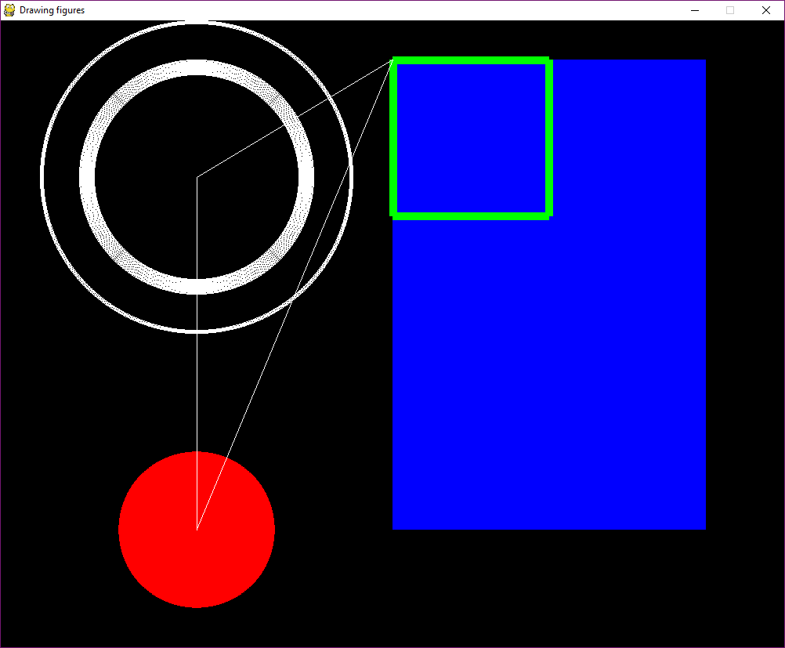

# Interaction {#interaction}

When you decided to learn programming you probably had something different in mind than putting some values in variables or compare apple with pears in conditionals. Most likely, your were more thinking of creating something with a little more magic then ASCII letters printed to the console. Perhaps, you already have an idea for a smartphone app on your mind. Who hasn't?

We won't push you that far. But, with conditionals in your hand, you are prepared to get to the next level and develop  *interactive programs* Interactive programs are those that run continuously and do something when the user presses a button or moves and clicks the mouse. They don't do something completely random, except for some artistic installations, perhaps, but react in a purposeful way to user input. We can say, that a program executes an *interaction model*, a set of rules that describe the programs behaviour. Then we show you how to write interactive programs very efficiently by turning the transition table into *transitionals*.

In this chapter we do more than just show you how to use a conditional or a loop. You will notice that writing an interactive program is more than just coding. It is a *development process* with a sequence of steps where the output of one step is input for the next.

        Your brain does              The result is
    --> [Interaction modelling]  --> Transition table 
    --> [Coding transitionals]   --> Interactive prototype
    --> [Coding presentationals] --> Pygame program.

First, we will teach you how to analyze an interaction problem and note down your ideas in a structured way, a *transition table*. Then we'll show you how to implement a prototype for testing the interaction protocol by turning the transition table into *transitionals*. Finally, we'll explain in more detail how to put the elements of interaction together in Pygame and give them a fluent appearance.


## Interaction models

An interaction model describes when the program does what. As simple as this definition is, making an interaction model is not. Rather, creating this model is an important part of sincere software development and happens long before you start coding. In essence, when starting to work  on an interactive program, the first you do is: switch off your computer, pull out pencils and paper and scratch your head. 

What we are asking you to do is envisioning the program you are going to write, eventually. The formal output of the interaction analysis is just one table that somewhat abstractly describes the flow of the program. That does not mean, that during the analysis you may do use other representations, such as flow charts or screen scribbles. The opposite is the case: seeing your program from different angles, will help you to come up with a better interaction model and the results can be used downstream, such as screen scribbles for the visual design.

As complex it is, an interaction model can be broken down into three sets of elements: states, transitions and events:

+ states are the different modes a program is in.
+ transitions let the program move from one state to another
+ events make these transitions happen

The scope of this book covers rather simple interactive programs only, psychological experiments. In order to explain the basics of interaction programming, we go for something even more simple: a Dutch traffic light.


### Identifying states

The first step in the analysis is to *identify states* of the program. A state is a rather abstract term, so let's see a few examples:

+ a light switch has the two states On and Off
+ the Dutch traffic light has the three signals Go, Attention and Stop
+ In MS Word, there are several different modes to view a document: Read, Print, Web.
+ ...

If you are making a model of an existing system in front of your eyes, that's called *reverse engineering*. One good heuristic to reverse engineer states is to simply observe the different visual forms the display takes. Then, the states are exmained further and are given a description and a label. So, let's reverse engineer the Dutch traffic light by watching one cycle of signals:

Here are the three displays of the traffic light:

    .    .    R
    .    Y    .
    G    .    .

Then we capture the purpose of state and give it What we have to capture in the first place in our analysis is the *purpose of states*:

1. Go: green light indicates that drivers may pass
2. Att(ention): yellow light indicates that drivers should prepare to stop
3. Stop: red loght indicates that drivers must wait

Notice how we named the states of the traffic light, or better how we did not call them Green, Yellow and Red. The description of the state should address the purpose of the state and not its appearance. Visual design comes at a much later point in the development process. 

### Identifying transitions

The second step in the analysis is about identifying the *transitions* between states. The Dutch traffic light knows three transitions:

    Go   --> Att
    Att  --> Stop
    Stop --> Go

Cycling through a set of states is the most simple interaction protocol. It is unique, in that states are arrenged in a closed cycle, which implies that every state appears exactly once on the left-hand side (the original state) and the right-hand side (the destination). As we will later see, this is why we also only  need one button for a manual traffic light.

Most of the time it is more complicated and one easily overlooks a possible transition. If  the number of states is not overwhelmingly large, transitions can systematically be found using a *transition table*. A transition table is just a square matrix, where you put the states into rows and columns. The rows denote the *origin* state, the columns are *target* states.

          Go  Att Stop
    Go
    Att
    Stop

According to the empty transition table, the traffic light has nine possible transitions. But which of them make any sense and should be implemented? We start in the first row and ask: "Does it make sense that a state Go is followed by itself?"  Here, the answer is No and you leave the cell just empty. But, there are situations, where you would want to make such a "selfish" transition, think of a dia show program, that, whenever a button is pressed, shows the next picture. The state Show_picture is followed by Show_picture. That also implies, that states can be somewhat abstract. It would make little sense to have a separate state defined for every picture in the show.

             Welcome  Present Goodbye
    Welcome           X
    Present           X       X
    Goodbye  

Let's move on: "Does a transition from Go to Att make sense?" Absolutely! You make a cross. Then you do the same for the second and the third row, leaving blank the impossble transitions and marking the possible. 

          Go  Att Stop
    Go          X
    Att             X
    Stop  X


It is important to realize, that transitions are not generally symmetric. In the case of a traffic light, you can go from Go to Att, but there is no transition back. In interaction models other than a uni-directional cycle, transitions can well be symmetric, think of the checkout process on webshops. Usually, they guide you through the process in a number of steps (billing address --> delivery address, credit card nmumber), but allow you to go back to the previous step to do corrections.

    Delivery    --> Billing
    Billing     --> Delivery
    Delivery    --> Credit_card
    Credit_card --> Delivery

                 Delivery  Billing Credit_card
    Delivery               x
    Billing      x                 x
    Credit_card            x

<!-- #5 specify initial state -->


### Events: internal conditions and user input

The transition table tells you which of the possible transitions are allowed and should be implemented. It does not yet tell you when this is going to happen, exactly. An *event* is a condition that triggers a transitions. Events can be internal conditions or user input. 

*Internal conditions* do not require user input. The program decides solely by itself, when to transit. This is why  we call transitions on internal conditions *automatic transitions*. A typical case of automatic transitions is control by a timer. If we assume that the Dutch traffic light runs automatically, without someone standing next to it (in a yellow vest) and pushing buttons, all transitions must be automatic. Certainly, we do not want the traffic light to change states instantly, but only after a certain time has passed. For the interaction model that means we have to specify the resting time in every state. We do that right on the transition table by replacing the crosses with a brief description of the condition that makes the system leave the origin state:

          Go  Att   Stop
    Go        20s
    Att             5s
    Stop  20s

In words, the interaction model is expressed like the following:

1. When in state Go, wait 20s, then transit to Att
2. When in Att, wait 5s, then transit to Stop
3. When in Stop, wait 20s, then transit to Go

In psychological experiments, such time-controlled transitions happen a lot. The purpose of some experiments is to investigate subliminal priming, where presnetation time is so short, that people cannot consciously process the stimuls, but there still are subconscious effects. For example, when very briefly seeing a picture of an apple, participants reportedly react faster to the question: "Is this a word? PEAR." In subliminal primning experiments, in order to control cognitive processing time, stimuli are presented for a very brief moment, followed by a visual mask (to erase visual sensory memory). Finally, the response is acquired as a key press (which is user input) and the program proceeds to the next trial.

          Stim  Mask   Resp
    Stim        100ms
    Mask               100ms
    Resp  X
    
That brings us to the second form of events: *user input* events. A transition that is triggered by user input is called an interactive transition. Only if there is at least one interactive transition, will we call it an interactive program. In most cases, user input is just pressing a certain key. Let's first look at how a manual traffic light can be specified. Taking another look at the transition table tells us:

+ there are three possible transitions
+ at every origin state there is only one transition possible

Because there is only one transition possible at every moment, it seems we can go with just one key, let's call it Next.


          Go  Att   Stop
    Go        Next
    Att             Next
    Stop  Next

In this case, it seems fairly practical to give the traffic light operator a remote control with just one button. But note that for more complex systems that is not a good idea in terms of usability. Why? Because of what is known as mode confusion. The ideal example probably is one of these 1980 clunky digital watches, which not just told you the time, but also let you use stop watches, timers, altitude alarms, step counters and brewing a nice cup of coffee. And all that functionality is controlled by just four flimsy buttons. What these buttons do, changes with the state the watch is in. For example, the lower left button could switch to another time zone in Watch, but do a reset in stop watch mode. The user has to learn from the manual what every button does in every state and has to be completely aware which mode the watch currently is in.

When desgning more complex interactions it is therefore better to use different user inputs (keys presses) for different actions. That does not mean you have to use a totally new control for every cell in the transition table. There can be actions that are very similar across states, such as an action Next or Previous in the checkout process example:

                 Delivery  Billing     Credit_card
    Delivery               Next
    Billing      Previous              Next
    Credit_card            Previous

Note that we keep the name of the controls rather abstract, denoting the action, not the physical key or mouse button. Like with the analysis of states, we defer the peoblem to a later state. The reason is to not get distracted at this stage, but also it makes the transition table easier to read, and let's us identify actions that could use the same control. How many controls you finally use in your program is a matter of careful choice. However, there is at least one rule: The number of separate controls must be equal to or larger than  the maximum number of interactive transitions in any row. According to this rule, the traffic light can have one or more controls, whereas the checkout program requires at least two (Billing).

In the checkout and traffic light examples, there is only one transition per state, but of course, there can be more than one. In the subliminal priming example, the participant's response is whether the shown letter combination is a word, or not. That implies that two controls are needed at that transitions, say the controls Word and Not_word. As the program will continue to state Stim, irrespectively of which of the two keys have been pressed. 


          Stim       Mask   Resp
    Stim             100ms
    Mask                    100ms
    Resp  Word or
          Not_word


This needs to be considered carefully, because if you end up putting two controls in the same cell it could be that you have not yet discovered all states. In the subliminal priming example, Resp is followed by Stim, irrespectively of user input. But, that is a special case.

The transition table is now complete. It covers states (in rows and columns), transitions (occupied cells) and events (what is in the cell). In the next section, we will build interactive programs by translating each cell in the table into a *transition conditional*.


### Exercises: 

1. Identify states and transitions of a stop watch
2. Review the Stroop program and find the states in the code. Then, take a closer look at where in the code states are used.


<!-- 7 rewrite

it down do a good analysis and break it down in manageable pieces. That  in this chapter we will To In this chapter, we are doing real software development, which is more than just coding.

In essence, this chapter is more than just coding, it introduces a basic, but systematic software development process.

Just imagine, With a little more experience, a transition table is easily translated into a Pygame 
program, but there is a lot of clutter, too. For that purpose we proceed by writing a prototype for the console, that has 
STATE = "Billing"the sole purpose of checking whether your interaction model does what you intended. -->

## Programming interactive prototypes

One of the worst things that can happen in software development is that a flaw that has been introduced during en early state of planning is discovered when the program is almost done. For that reason, is is good practice in software development to test models and catch flaws as early as possible. So, how can we test our interaction model? Of course, we could just implement the whole program and then see, if it does what was intended. But, if there truly are flaws, a lot of effort would have been wasted and a lot of work had to be redone. This catch-22 situation can be resolved by implementing just the aspect of the system that you want to test, for example the flow of interaction. This is called a *prototype* and, as you will see, the transition table can quickly be translated into a simple piece of software, an *interactive prototype*, using just a few standard coding patterns.

For the interactive prototype, we will turn the transitions from the table into *transition conditionals* or short: *transitionals*. As we have two kinds of transitions, automatic and interactive, we will also have to deal with interactive and automatic transitionals.


### Interactive transitionals

The following code snippet implements two interactive transitional with the same origin, namely the transition from Billing to Delivery and Credit_card:


```{python, eval = F}
if STATE == "Billing" and key == "p":
  print(STATE)
  key = input("Press a key: ")
  STATE = "Delivery"
if STATE == "Billing" and key == "n":
  print(STATE)
  key = input("Press a key: ")
  STATE = "Credit_card"
print(STATE)
```

Notice that

1. the state of a program is maintained as a plain String variable
2. the starting state is set as "Billing"
3. interactive transitionals check for two conditions: current state and whether the respective key has been pressed
4. a transition occurs by setting the variable `STATE` to another value

The above code will only ask for user input once, change the state (or stay in Billing, if no valid input was entered) and terminate. Instead, we want this program to truly flow and be able to react on longer series of user actions. Basically, the only thing we have to do is put the transitionals into a loop. However, in this particular case, what would happen is that the program would never truly stop. For that purpose, we implement a general state called Exit, that ends the program. The transitions of Exit are special, in that this state always is the destination, never the origin. This is why we can omit the row. In many cases you also want to respect the users freedom and allow them to jump to Exit at any time they want:


                 Delivery  Billing     Credit_card  Exit
    Delivery               Next                     X
    Billing      Previous              Next         X
    Credit_card            Previous                 X, Next

The interaction prototype of Checkout looks like the following. 


```{python, eval = F}
STATE = "Delivery"
while True:
  
  print(STATE)
  key = input("Press a key: ")
  
  # interactive transitionals
  
  if STATE == "Delivery" and key == "n":
    STATE = "Billing"
    continue
  if STATE == "Billing" and key == "p":
    STATE = "Delivery"
    continue
  
  if STATE == "Billing" and key == "n":
    STATE = "Credit_card"
    continue
  if STATE == "Credit_card" and key == "p":
    STATE = "Billing"
    continue
  
  if STATE == "Credit_card" and key == "n":
    STATE = "Exit"
    continue
    
  if key == "x":
    STATE = "Exit"
    continue
    
  if STATE == "Exit":
    break
    
    
exit()
```

Notice that:

1. the loop itself comes with no conditions itself. It just plainly loops, as long as someone proves that the truth is not true.
2. the print statement at the top of the while loop entirely replaces the graphical user interface at  this stage. 
3. after every transitional, we have put a `continue` statement. Why? Because, when the State veriable is updated, it can fire up a second transitional. Check yourself, by reading the conditionals: within one iteration we would go from Delivery to Exit all the way through and we would not even see the intermediate steps printed to the console. The `continue` statement forces the loop to begin a new iteration, immediatly, omitting all the transitionals after the one that has fired. That makes sure that per iteration no more than one state transition takes place.
4. We use a transitional that does not ask for the state and therefore always triggers Exit when x is pressed
5. the Credit_card --> Exit transitional uses `continue` in order to reach the `print(STATE)` command one more time. During that final iteration only, the last transitional (the one without destination) is encountered and the `break` statement ends the loop.

In general, interactive transitional emerge from the transition table by the following pattern:

```{}
if STATE == <origin> and <event>:
  STATE == <state>
  continue
```

Notice that every combination of state and event gets its own `if ... continue` block. We call this *flat transitionals*. Another way is to use *nested transitionals*, which have an an outer `if` block to interrogate the state and uses the inner `if` block to deal with all possible events, The general form is:

```{}
if STATE == <origin>:
  if   <event_1>:
    STATE = <next_state_1>
  elif <event_2>:
    STATE = <next_state_2>
  elif ...
  continue
```

There is no difference in functionality between these two forms of transitionals, but for longer programs it may be easier to read. With nested transitionals, the checkout program would look like the following: 


```{python, eval = F}
STATE = "Delivery"
while True:
  
  print(STATE)
  
  key = input("Press a key: ")
# interactive transitionals
  if STATE == "Delivery" and key == "n":
    STATE = "Billing"
    continue
  
  if STATE == "Billing":
    if key == "n":
      STATE = "Credit_card"
    if key == "p":
      STATE = "Delivery"
    continue
  if STATE == "Credit_card":
    if key == "n":
      STATE = "Exit"
    if key == "p":
      STATE = "Billing"
    continue
  
  if STATE == "Exit":
    break
```

Notice that 

1. the indentation visually groups all transitions that belong to the same origin state
2. we reduced the number of `continue` statements. As `key` is never changed inside a transitional, only a single event conditional is triggered at a time.


### Automatic transitions

Sometimes we want a transition to happen due to internal conditions of the program, for example:

+ stay in state Att, when 5 seconds have passed move on to Stop
+ show the stimulus for 100ms, then move on to the distraction mask.
+ after 20 trials of an experiment, make a pause.
+ after all dias have been shown, give a Goodbye

A frequent case of automatic transitions is staying in a state for a certain amount of time, then move on to the next state. Take as an example a dia show program that automatically shows every picture for, say, 30 seconds. Fortunately, automatic transitions almost look the same, the only difference being that `<event>` becomes `<condition>`. 

As you have experienced at the Stroop task theater play from chapter \@ref(intro) dealing with time requires some extra tricks. For example, how do we let the automatic traffic light rest in the Go state for exactly 20 seconds? We set a timestamp and wait for the difference to become 20 seconds or longer. Fortunately, for interaction prototypes, there is a cheap and  dirty trick to do that more straight-forwardly, which is the command  `sleep(20)`. It suspends the whole program and wakes it up after twenty seconds. Why is that dirty? For two reasons: First, it only works for interaction prototypes, but not Pygame programs. For example, when you are showing animated stimuli, putting the whole program on halt won't work. Second, you will not be able to bypass the waiting time, say, the user wants to prematurely proceed to the next picture in the dia show.


```{python, eval = F}
from time import sleep
STATE = "Stop" # Att, Go
while True:
    print(STATE)
    if STATE == "Go":
      sleep(2)
      STATE = "Att"
      continue
      
    if STATE == "Att":
      sleep(1)
      STATE = "Stop"
      continue
      
    if STATE == "Stop":
      sleep(2)
      STATE = "Go"
      continue
```


A program can be (and typically is) a mix of interactive and automatic transitionals. For example, we could create a semi-automatic traffic light, where the operator only has to switch Stop and Go. When set to Stop, the program first goes to state Att, rests there for a few seconds and than automatically moves on to Stop. 


```{python, eval = F}
from time import sleep
STATE = "Stop" # Att, Go
while True:
    print(STATE)
    if STATE == "Go":
      input("Hit Return")
      STATE = "Att"
      continue
      
    if STATE == "Att":
      sleep(2)
      STATE = "Stop"
      continue
      
    if STATE == "Stop":
      input("Hit Return")
      STATE = "Go"
      continue
```

Notice that 

1. the `input` commands moved into the transitionals as otherwise the loop would prompt for input for automatic transitions, as well, which is just not the idea. Later, we will use the event handling mechanism of Pygame, which will provide a better solution for mixing interactive and automatic transitionals.
1. we have simplified the event handling. This traffic light needs just one control button to toggle Stop and Go, which here is any key (followed by Return) or just the Return key. That is not a general solution, but only works, because there is just one transition per state.


### The timestamp method

As we have said, for a prototype, the `sleep(s)` is fine in most cases to cause a delayed reaction, but not when we start coding with Pygame. Then we have to use the timestamp method, which has little benefits for interactive prototypes. Still, it seems in order to introduce this method on the somewhat cleaner code of the interactive prototypes.

The following code shows, how to implement a time delay by setting a timestamp and comparing the difference with current time in the automatic traffic light example. 


```{python, eval = F}
from time import time
STATE = "Go" # Att, Go
time_stamp = time()
while True:
    
    current_time = time()
    
    if STATE == "Go" and current_time - time_stamp >= 2:
      STATE = "Att"
      time_stamp = time()
      print(STATE)
      continue
      
    if STATE == "Att" and current_time - time_stamp >= 1:
      STATE = "Stop"
      time_stamp = time()
      print(STATE)
      continue
      
    if STATE == "Stop" and current_time - time_stamp >= 2:
      STATE = "Go"
      time_stamp = time()
      print(STATE)
      continue
```

Notice that

+ the second condition of time-controlled transitionals carries the waiting time
+ the function `time()` returns the number of seconds since 1 January 1970. That is called the Unix epoch.
+ because the starting state Go is time-controlled, we have to set a first timestamp before the `while` loop starts.
+ the print statements have been moved into the transitionals. Read more on that below.
+ `current_time` is set once at the beginning of every iteration. Read more on that below.


It appears as if going from the `sleep` method to the `time` method is just some superficial change in code. In fact, there is one dramatic change once the program runs, although you may not even realize it on the first glance. With `sleep`, the `while` loop does exactly one iteration per state change, that is one per five seconds (combined sleeping time). When entering a transitional, the sleep is initiated and the program rests. Then it wakes up and finds the `continue`, eventually. In the timestamp version, the program never sleeps. The while loop cycles as fast as it can, which is incredibly fast, at every iteration picking up `current_time` and comparing it to the timestamp. Find out yourself, by putting the `print(STATE)` back to its old place, at the top of the loop.

We will use the exact same method in Pygame. But, here it is, why the method does not work well with the prototype. The system we have chosen was the traffic light. That was on full purpose as it is fully automatic. The problem is the `input` command, as it waits for input. While it does, the loop stands still. In order to combine user input with a fast while loop, we would need another way of handling input events. That is what Pygame will provide.


<!--
### Continuous event handling

With the time stamp method we can write our prototype in a way that comes closer to the final Pygame program, which also has a fast paced `while` loop to make for a fluent user interface. Another advantage of the time stamp method is that we can react to input while we wait. An example is 
-->


### Presentation conditionals

If you inspect the interactive prototyping code so far, you will notice that all output is produced by a single `print` statement, which resides outside of the transitionals. That is fully on purpose, deriving from a golden rule of user interface development, as we will see later. 

The sole purpose of a traffic light is to transit between states and make these states visible to the user In general, interactive programs do more than just transit from state to state. They usually process some sort of data or information. Very often, the user input at one state, affects the display of a subsequent state.

The one It suffices to check the interaction flow, but lacks the ability  This is a very poor solution, as it only checks the primary state the program is in. In order to check the logic of the program it is useful to enrich tehz output further. For example, in the traffic light example, we may want to show the tr5affic light, not just its state.

It is tempting to just the print statements into the transitionals, but that will finally not work at all with Pygame programs. Recall what we said in the beginning of this chapter about breaking a complex problem into manageable pieces. In software development it is accepted best practice to clearly separate two aspects of an interactive program: the flow of states and the presentation on screen. There even is a name for this approach, its called a *two-tier architecture*. While this may seem over done at the toy examples, we use here, but it has significant advantages in the long run:

+ You can focus on one thing at a time, typically starting with the flow of the program and once that is done, move on to screen design.
+ You can even separate the two tasks: one expert is doing the interaction flow, and another expert creates the screens.
+ It works with Pygame.

In order to be more flexible with what the prototype presents to the screen when in a state, we will expand the `print(STATE)` statement into a set of *presentation conditionals (presentitionals)*, allowing us to create different output for different states. We demonstrate the idea by the example of the checkout process. 

Notice that:

1. Presentationals *never* change the state as that is the domain of transitionals.
1. presentitionals are triggered by states, simply. If you find yourself wanting to add another condition, say whether the response was correct, that can either go into teh presentitional itself or you can split the state into two separate ones.  
1. we use `if` statements without `continue`. If we would do otherwise, the iteration would jump over our carefully crafted transitionals and nothing will ever happen anymore. We also don't need to break the iteration, because the program always is in exactly one state and the presetitionals never change state. That makes sure that exactly one presentitional will fire during a single iteration.
1. presentitionals come before transitionals, as otherwise they would fall prey to the `continue` statement and never show up. With Pygame, due to its better event handler mechanism, this is no longer necessary and it seems more logical to put presentitionals last.


```{python, eval = F}
STATE = "Delivery"
while True:
  
  # presentation conditionals
  
  if STATE == "Billing":
    print("n for proceed")
    billing  = input("Please, enter your billing address")
  
  if STATE == "Delivery":
    delivery = input("Please, enter your delivery address")
    print("p for previous, n for next")
  
  if STATE == "Credit_card":
    print("n for next, p for previous")
    credit_card  = input("Please, enter your billing address")
  
  if STATE == "Exit":
    print("We received your order")
    break
    
  
  key = input("Press a key: ")
  # interactive transitionals
  if STATE == "Delivery" and key == "n":
    STATE = "Billing"
    continue
  
  if STATE == "Billing":
    if key == "n":
      STATE = "Credit_card"
    elif key == "p":
      STATE = "Delivery"
    continue
  if STATE == "Credit_card":
    if key == "n":
      STATE = "Exit"
    elif key == "p":
      STATE = "Billing"
    continue
```


## Interactions in Pygame

### Overall structure

1. setup
1. initialize display
1. fast `while` loop doing the display refresh
3.    event handler `for` loop
4.      interactive transitionals
5.    automatic transitionals
6.    presentitionals
7. drawing functions

Before we dive into the matter of interaction programming with Pygame, there is one aspect of the template that is worth briefly mentioning, the `def main():` statement. The only thing it does is to encapsulate the central part of your code as a function, which is called in the last line of code.


### Screen and display loop.

With Pygame you can create interactive programs with fancy geometries and fluent animations. In fact, all computer animations are just pseudo-fluent. It is like in the movies: a fluent movement, like that of a jumping ball, is captured in a high speed. It is just a sequence of still images, but by the sluggish human visual system it is perceived no less fluent than the real scene.

In a Pygame program, an animation is created by a series of stills, too, with the only difference that these stills are not on celluloid. They get computed in an instance and transfered to the computer screen in fast succession, like 60 per second (60Hz). This happens as followed:

1. setting up the display
1. a fast while loop runs continuously, at every iteration:
2.   the screen is refreshed by painting the background color over the previous image
3.   the next image is computed by transitionals and presentitionals
4.   the display is updated with the new image

A single iteration of the fast while loop we call *a refresh*.


```{python, eval = F}
BACKGR_COL = col_gray
SCREEN_SIZE = (700, 500)
pygame.init()
pygame.display.set_mode(SCREEN_SIZE) 
pygame.display.set_caption("Stroop Test")
screen = pygame.display.get_surface()
font = pygame.font.Font(None, 80)
font_small = pygame.font.Font(None, 40) 
def main():
  # fast while loop
  while True:
  
          # refreshing the display
          screen.fill(BACKGR_COL)        
  
          # Event loop
  
              # interactive transitionals                     
  
          # automatic transitionals
  
          # Presentitionals
  
          # Updating the display
          pygame.display.update()
main()
```

Notice that:

1. The code for setting up the display looks complicated, but it usually suffices to just copy that part of the code whenever we start a new project. Still, you probably want to configure a few aspects to your requirements: 
    + choose a background color, e.g. `col_black` or `#FFFFFF` (white)
    + set the width and height of the screen by changing `SCREEN_SIZE`
    + change the caption of the screen (to appear in the top bar of the window)
    + change font and font size


### Handling user input

With Pygame you can create interactive programs that react fluently to user input. There no longer is a prompt that waits for input and requires Return to continue. User input in Pygame programs is handled by a very clever mechanism called the *event handler queue*. You don't actually see it, as it is set up behind the scenes by `pygame.init()`. It acts a lot like a descretive secretary: it stays in teh background and collects the incoming messages, hands them over one by one to the executive and lets her do her own thing with it.

While the fast `while` loop runs in the foreground, the event handler is a separate mechanism that continuously listens to input from keyboard or mouse. Whenever something happens, a key is pressed or the mouse is pushed, the event handler registers this event and puts it in a queue. At every regresh this queue is retrieved and emptied by `pygame.event.get()`, which returns the queue as a list. The event `for` loop iterates over this list, pulling out the events one by one out and handing them over to the interactive transitionals.


```{python, eval = F}
# Event handler
for event in pygame.event.get(): 
    # interactive transitionals                     
    if STATE == "welcome":
        if event.type == KEYDOWN and event.key == K_SPACE:
            STATE = "prepare_next_trial"
            print(STATE)
            continue
```

Notice that

1. when there is no input, the event loop never runs and none of the interactive transitionals wil fire. The event handler loop acts like a conditional most of the time. It sits in the fast refresh loop and therefore is idle most of the iterations.  That is why you should never put automatic transitionals into the event loop.
1. `pygame.event.get()` returns the event queue, but also empties it. Otherwise, events would be eveluated over and over again.
1. an event is a complex piece of information. For a key press, the type of the event is `KEYDOWN` and it has a property key that holds the key that has been pressed.
1. if more than one event has been recorded, they are all being processed in a single refresh. That can mean more than one transition per refresh.
1. We still need `continue` to make sure that only one transitional per event is fired. While the event handler queue is consumed (emptied) by `pygame.event.get()`, the variable `event` is not. If two successive transitionals use the same event (e.g. n for next), they would both be triggered.


### Transitionals

Interactive transitionals differ only slightly. Because of the event handler mechanism they no longer reside under the fast `while`, but one level deeper in the event handler loop. If you use a print statement to see the state transitions on the console, these must go into the individual transitionals, see yourself:


```{python, eval = F}
# Event loop
for event in pygame.event.get():
    
    # interactive transitionals                     
    if STATE == "welcome":
        if event.type == KEYDOWN and event.key == K_SPACE:
            STATE = "prepare_next_trial"
        print(STATE)
        continue
            
    if STATE == "wait_for_response":
        if event.type == KEYDOWN and event.key in KEYS.values():
            time_when_reacted = time()
            this_reaction_time = time_when_reacted - time_when_presented
            this_correctness = (event.key == KEYS[this_color])
            STATE = "feedback"
        print(STATE)
        continue
    if STATE == "feedback":
        if event.type == KEYDOWN and event.key == K_SPACE:
            if trial_number < n_trials:
                STATE = "prepare_next_trial"
            else:
                STATE = "goodbye"
        print(STATE)
        continue
            
    
    if event.type == QUIT:
        STATE = "quit"
        print(STATE)
        break
```

Notice that:

1. the event condition gets a little more complicated (more on that below) and that lets us prefer nested transitionals
1. the second transitional does a little data processing, namely capturing the response time by the time stamp method.
1. the third transitional contains two transitions, which we call a `branching transitional`. The inner most conditional interrogates the number of trials that have already been presented and either moves on to another trial or teh end of the experiment.
1. the last transitional breaks the event handler loop. If the user wants to quit, he wants to quit and not wait for the event handler loop to finish the queue.

Automatic transitionals in Pygame differ in no way from automatic transitionals in console prototypes, except when you have to use the time_stamp method to cause a delay. They have the same structure and they remain directly under the fast `while` loop. 


There is one automatic transitional in the Stroop program, that is a little special on closer examination: With every new trial, the transitional `prepare_trial` is triggered and automatically the program moves on to `show_trial`. On closer  examination this transitional is different to the ones we have seen before, because the state `prepare_trial` does not have a presentational. It is completely invisible to the user, a *ghost transitional*. We also notice that there is quite some extra code inside. Some serious data processing is done, before the actual transition.


```{python, eval = F}
# automatic transitionals
if STATE == "prepare_trial":
        trial_number = trial_number + 1
        this_word  = pick_color()
        this_color = pick_color()
        time_when_presented = time()
        STATE = "show_trial"
        print(STATE)    
```

This transition actually prepares all aspects of the stimulus, before it is shown. But, why aren't these computations just be done during a direct transition to `show_trial`? In fact, for the little program we have here, it does not matter. It is just there to have one automatic transitional.

But, there are situations, where using ghost transitionals can be useful

+ when the data processing  is complex. Then, it seems more natural to think of the progranm being in data processing transition.
+ when the data processing lets the program branch. For example, we could define two separate states for trial feedback, for correct and incorrect responses. Then, it seems more natural to put the computations and branching into a "knot" on its own.

IN both cases, the program will be easier to understand and debig, but there is no difference in functionality.


### Pygame events

The event handler collects the events between two refreshes and hands it over to the event  loop. We have already seen on the transitionals that events are more complex than just literal characters. That makes sense, when you consider that also mouse events are being captured. They cannot be expressed as a characters, but as either coordinates (when the  mouse is moved) or as button presses at a certain position on the screen.

But let's look at keyboard input, first, as they appear in the Stroop program. They are all have the same in structure in their inner event conditions:

```{}
  if event.type == KEYDOWN and event.key == K_<key>:
```

So, this conditional asks for the type of the event, which is that a key has been pressed down. Note that this is more basic than that a key has been entered, as that would also mean it has been released. The secod condition is about the key. Different to our prototypes, this is not a literal character, but a constant, that Pygame has predefined. That helps to deal with keys that  do not have a character assigned, such as Return, Alt, Ctrl and the arrows on your keyboard. The full list of key definitions can be found in the [Pygame documentation]:(https://www.pygame.org/docs/ref/key.html).


When theer is a `KEYDOWN` there must also be a `KEYUP` event type, that is recorded, when the key is released again. That can be quite useful, when the goal is to do something as long as the key is pressed. Just try out what the key arrow_up does when you are editing a document. It moves the cursor up the lines until you release it.

The full list of event types is given in the [Pygame documentation]:(https://www.pygame.org/docs/ref/event.html). Here we will only briefly explain the most important, which is the event type QUIT and all mouse event types:


```{python, eval = F}
if event.type == QUIT:
  STATE = "quit"
  break
```
 
This actually corresponds with the alltime exit that we once implemented in the prototype. Usually, the QUIT event is the same as a key press on the ESC key. And if you try it out, you will see that you can cancel the Stroop program at any time pressing ESC. It is no more than a short cut.

Mouse events come as several types with different properties, the two most important ones are:

+ a MOUSEMOTION event is recorded when the mouse pointer has moved during the refreshes. It has an attribute `event.pos`, which is a list of two numbers, the x and y coordinates of the new pointer position.
+ MOUSEBUTTONDOWN is recorded when a mouse button is pressed down. The attribute event.button identifies which button it was (LEFT, RIGHT).

See these two events in action in the following little program:


```{python, eval = F}
import pygame
import sys
from time import time
from pygame.locals import *
import random
from pygame.compat import unichr_, unicode_
##### VARIABLES #####
# Colors
col_black = (0, 0, 0)
col_green = (0, 255, 0)
col_green_dim = (0, 60, 0)
BACKGR_COL = col_black
SCREEN_SIZE = (500, 500)
pygame.init()
pygame.display.set_mode(SCREEN_SIZE)
pygame.display.set_caption("Mouse events")
screen = pygame.display.get_surface()
screen.fill(BACKGR_COL)
def main():
    STATE = "not_clicked"
    mousex = 0
    mousey = 0
    while True:
        screen.fill(BACKGR_COL)        
        for event in pygame.event.get():                        
            # IT
            if STATE == "not_clicked":
                # mouse moved, new pointer position is stored
                if event.type == MOUSEMOTION: 
                    mousex = event.pos[0]
                    mousey = event.pos[1]
                    continue
                # left mouse button clicked
                if event.type == MOUSEBUTTONDOWN and event.button == LEFT: 
                    STATE = "clicked"
                    time_when_clicked = time() # timestamp for "unclicking"
                    continue
            if event.type == QUIT:
                pygame.quit()
                sys.exit()
        # AT
        # unclicking after 500ms
        if STATE == "clicked" and time() - time_when_clicked > 0.5: 
            STATE = "not_clicked"
        #  Presentitionals
        if STATE == "clicked":
            draw(mousex, mousey, True)
        
        if STATE == "not_clicked":
            draw(mousex, mousey, False)
        
        pygame.display.update()
def draw(posx, posy, clicked):
    if clicked:
        color = col_green
    else:
        color = col_green_dim
    text_surface = font.render(str(int(posx)) + ':' + str(int(posy)), True, color, BACKGR_COL)
    text_rectangle = text_surface.get_rect()
    text_rectangle.center = (SCREEN_SIZE[0]/2.0,SCREEN_SIZE[1]/2.0)
    screen.blit(text_surface, text_rectangle)
main()
```

Notice that

1. `event.pos` is a list of two vakues, the x and y coordinates
1. Pygame provides the mouse buttons as constants, which are not to be put in quotation marks.
2. it is unsafe to create new variables inside an event, as you never know when it happens. It is better to explicitly create variables (mousex, mousey) at the top of the main program
3. there are two presentitionals, but they both use the same function to do the  drawing


<!-- #12 -->


## Presentitionals in Pygame

And, here we're getting to the candy! With Pygame presentitionals we give our program a face. The presentitionals of Pygame have the same formal structure as the prototype presentitionals, so there is nothing more to say about it. This chapter shows you how to create graphical user interface that render stimuli, show pictures, play animations and have buttons.

The Pygame system has been developed for arcade games and is very powerful when it comes to creating and transforming graphical objects. Unfortunately, that also makes it very complex, which is why the functions have so many dots in their names. Fortunately, many psychological experiments are at most as complex as the simplest arcade game. Introducing a small subset of Pygame functionality is sufficient. For when you are a geek take a look at other books on game development with Python.

Recall that at every refresh the screen is almost literally painted over. In fact, every one presentitional can be considered a drawing on its very own. That allows us to demonstrate the elements of Pygame graphics in simple programs, that produce a still picture. That also matches the way you should proceed, when writing the transitionals: first you write the scaffolding code, which consists of all the presentitional and their empty draw function. Then you grab the draw functions one by one and program the visuals, using text, geometric figures and pictures. Here is how the scaffolding looks like:


```{python, eval = F}
if state == "some_state":
  draw_some_state()
  
if state == "some_other_state":
  draw_some_state(some_property)
  
pygame.display.update()
  
def draw_some_state():
  pass
  
def draw_some_other_state(some_property):
  pass
```

Notice that:

1. we do *not* use print statements in presentitionals, as they are in the fast loop.
1. often, it is useful to make the draw function more generic and use function arguments to fix some properties.


### Display and surface

Creating the appearence of states means to draw things to the surface (also known as screen or canvas). However, before we can do so, the surface itself must be created. Also, we have to understand the "physical properties" of the surface.

Like almost any other program, a Pygame program appears as a window, just like the one in which this text is displayed, be it a browser or a pdf viewer. This windows is composed of the frame, which consists of a rectangular edge, a title bar with a caption and the Windows controls |_|| ||X| in the upper right corner. Between the edge sits the surface. The first thing that needs to be done is creating this window, which is called the *display* in Pygame terminology. The following code creates a minimal Pygame display with a surface that is 600 pixel wide and 400 pixel high and puts "A Pygame display" into the title bar. The only thing it can do is quit properly.


```{python, eval = F}
# Required libraries
import pygame
import sys
from pygame.locals import *
from pygame.compat import unichr_, unicode_
# Initializing the display
pygame.init()
pygame.display.set_mode((600, 400))
pygame.display.set_caption("A Pygame display")
# Creating the surface
surface = pygame.display.get_surface()
surface.fill((0,0,0))
def main():
    while True:
        for event in pygame.event.get():
            # IT
            if event.type == QUIT:
                pygame.quit()
                sys.exit()
        pygame.display.update()
main()
```

Notice that:

1. When initializing the display, there is no assignment operator involved. There is only one display object `pygame.display` which magically appears by initializing pygame. However, to some extent you can configure it to your liking.
1. As we do it here, the display is set to a fixed size and you won't be able to resize the window during runtime. There is a way to make it resizeable, but that would complicate matters when it comes to drawing to the surface.
1. The surface is an object that is created by `pygame.display.get_surface()` and assigned the name `surface` here. Thus, you can give it another name and, in fact, we call  it "screen" or "canvas" in other examples of this book.
1. With `surface.fill()` you give the surface a color. For more on colors, read on.
1. It is the display that is updated (refreshed), not the surface, which is just a little counter-intuitive, as the surface is where we draw.
1. Although the program does nithing noteworthy, we included the event handler with a quit transition. If we do not, closing the window becomes a surprisingly difficult task.

There is more to say about the surface than you can actually see in this example. One thing to notice is that the size of the surface is given with *pixel* as a unit. What is a pixel? Take a loupe and look at your computer monitor closely. You will see tiny dots, each of which is composed of three differently colored areas. These dots are the pixel and everything you draw or render to the screen is actually composed of pixel. It seems natural to use pixel as a unit of measurement when programming graphics, as long as we precisely know the size of the surface. One reason for not using metric (mm, cm) as units is that pixel size can differ a lot between monitors. Use the same loupe on teh display of your smartphone to check this yourself. This is why, here, we always work with fixed size displays. 

Objects are placed on the canvas by *coordinates*, and these are given in pixel, too. While we are used to coordinate systems that have the origin (x = 0, y = 0) in the lower left corner, Pygame surfaces have the *origin (0,0) in the upper left corner*. The historical reason is that the old clunky electron ray tubes start a new refresh in the first line, from left-to-right. Perhaps, it is easier to remember that it is like writing a text.

By `pygame.update.display()` the refresh loop updates the display at every iteration. This update collects all the graphical elements that have been produced during that iteration and puts them to the surface. However, speaking figuratively this is *unlike* grabbing a fresh canvas and do the drawing. It is much like how the old masters worked with oil on canvas. New or updated elements are over-painted. Areas that are not affected by over-painting stay just as they are. In computer games that perfectly makes sense. When navigating a character, say the famous Pacman, the maze is constant and it makes little sense to update it every 60th of a second. In the interactive programs we are dealing with, here, the interface layout changes more often and, in order to play it safe, we always do the `surface.fill()` in order to create a blank sheet at every refresh.

Speaking of *colors*: after creating the surface, we filled it with our background color of choice, which is the tupel `(0, 0, 0)`. Why these three numbers? Remember what you saw through the loop: every pixel is composed of three subpixel of different colors, namely: Red, Green and Blue. That is how every computer in the world composes colors: as an *additive mixture* of these three colors. In short, we call it the *RGB system*. Every subpixel has a fixed color, but the brightness of the color can vary, taking values from 0 to 255 (which happens to be called a byte). For a few examples, check out the Stroop program, where a number of colors have been predefined as tupels. So, `(0, 0, 0)` means that all three color channels are dark and the results is Black. On the very opposite `(255, 255, 255)` means all channels fire at maximum brightness, which results in White.

<!-- #14 -->

### Drawing figures

<!-- #16 -->


```{python, eval = F}
import pygame
import sys
from pygame.locals import *
from pygame.compat import unichr_, unicode_
pygame.init()
width = 1000
height = 800
pygame.display.set_mode((width, height))
pygame.display.set_caption("Drawing figures")
screen = pygame.display.get_surface()
screen.fill((0,0,0))
def main():
    while True:
        screen.fill((0,0,0))
        for event in pygame.event.get():
            if event.type == QUIT:
                pygame.quit()
                sys.exit()
        
        draw_circ(250, 200, 200, (255, 255, 255), 5)
        draw_circ(250, 200, 150, (255, 255, 255), 20)
        draw_circ(250, 650, 100, (255, 0, 0), 0)
        
        draw_rect(500, 50,  400, 600, (0, 0, 255), 0)
        draw_rect(500, 50,  200, 200, (0, 255, 0), 10)
        
        draw_tria(250, 200, 250, 650, 500, 50)
        
        pygame.display.update()
def draw_circ(x, y, radius, 
              color = (255,255,255), 
              stroke_size = 1):
    pygame.draw.circle(screen, color, 
                       (x,y), radius, stroke_size)
def draw_rect(x, y, 
              width, height, 
              color = (255,255,255), 
              stroke_size = 1):
    pygame.draw.rect(screen, color, (x, y, width, height), stroke_size)
    pass
def draw_tria(x_1, y_1, 
              x_2, y_2,
              x_3, y_3, color = (255,255,255), 
              stroke_size = 1):
    points = ((x_1, y_1), (x_2, y_2), (x_3, y_3))
    pygame.draw.polygon(screen, color, points, stroke_size)
    pass
main()
```



Notice that:

1. The order of drawing commands determines how figures are painted over one another.
2. Sometimes it is useful to write your own wrapper functions for Psygame commands. Here, it is mainly for the purpose of creating a matrix-like appearance by function names of equal length.
3. Even static programs should have a minimal event loop that reacts properly when the user wants to quit the program.


### Placing text and pictures

Putting text on the screen is something that we experience everyday, when we read the internet, write emails or write code. One might think that this is as straight-forward in Pygame as creating figures. It is not that easy, though, and in order to understand why these complications arise, think about the following: When you want to write on a note "DON'T WORRY!" with a surrounding box. What do you do first, the writing or the box?

You put the writing first, because only after you have written do you see how high and wide the written text is. And the same problem happens when rendering text on Pygame surfaces. Fonts differ and even individual characters differ. There is no more reasonable way, to determine the size of the text box, after it has been rendered. To solve the problem, we divide the drawing process in two parts: the *rendering* part creates an object of the text box in the computer memory, without sending it to the surface, yet. From this object, we can retrieve the properties of the text box, most notably its dimensions. Even better, this object can be manipulated in many ways, for example resizing or moving it [Pygame doc](https://www.pygame.org/docs/ref/rect.html). Only after that, the text object is send to the surface.

In the following program we merged both steps into a more programmer-friendly function that almost behaves like the figure drawing commands. The only difference: you don't know in advance how large the textbox will be.


```{python, eval = F}
import pygame
import sys
from pygame.locals import *
from pygame.compat import unichr_, unicode_
pygame.init()
width = 1000
height = 800
pygame.display.set_mode((width, height))
pygame.display.set_caption("Drawing figures")
FONT = pygame.font.Font('freesansbold.ttf',40)
SURF = pygame.display.get_surface()
SURF.fill((0,0,0))
def main():
    while True:
        SURF.fill((0,0,0))
        for event in pygame.event.get():
            if event.type == QUIT:
                pygame.quit()
                sys.exit()
        
        draw_text(x = 0, y = 0, text = "Pygame says:")
        draw_text(x = width/2, y = height/2, text = "Hi there!", 
                  center = True)
        
        pygame.display.update()
def draw_text(x, y, text,
              color = (255, 255, 255),
              center = False):
    rendered_text = FONT.render(text, True, color)
    # retrieving the abstract rectangle of the text box
    box = rendered_text.get_rect()
    # this sets the x and why coordinates
    if center:
        box.center = (x,y)
    else:
        box.topleft = (x,y)
    # This puts a pre-rendered object to the screen
    SURF.blit(rendered_text, box)
 
main()
```

Notice that:

1. First, we actually have to select a font for the text. Here. this is set globally.
1. The coordinates of the function refer to the upper left corner by default, but can be set to refer to teh center of the box.
1. The `SURF.blit()` command sends the rendered text and the textbox to the surface. 
1. The box is first retrieved from the rendered text, then moved and finally send to the surface.
1. The function `draw_textbox()` uses `pygame.transform.smoothscale()` to force the text into a given width and height. The results don't neccessarily look good.
1. We have consistently put all global variables into capital letters to avoid confusion between globalö and local variables.

Working with pictures is very similar to text boxes. Again, you only know the size once you have loaded the file from your hard drive.


```{python, eval = F}
def main():
    while True:
        SURF.fill((0,0,0))
        for event in pygame.event.get():
            if event.type == QUIT:
                pygame.quit()
                sys.exit()
        
        draw_picture(x = WIDTH/2, y = HEIGHT/2, file = "Beach.png", 
                     center = True,
                     scale = 0.5)
        pygame.display.update()
def draw_picture(x, y, file, scale = 1, center = False):
    picture = pygame.image.load(file)
    # retrieving the box
    box = picture.get_rect()
    # transformation
    if scale != 1:
        new_width = int(box.width * scale)
        new_height = int(box.height * scale)
        picture = pygame.transform.smoothscale(picture, 
                                               (new_width, new_height))
        box = picture.get_rect()
    # getting the new box
    if center:
        box.center = (x,y)
    else:
        box.topleft = (x,y)
    SURF.blit(picture, box)
 
main()
```

Notice that 

1. the picture file resides in teh same directory as the program. If that is different you have to use relative paths. Avoid absolute paths, as this makes the program less portable.
1. in the function definition, we put the scale arguent at the end, although an earlier position would be more logical. The reason is that all argument without a default have to come first, such as file.
1. `picture.get_rect()` is called twice. After the scaling the box gets an update
1. Putting the scaling part into a conditional is not necessary, but saves computation where it is not needed.

#### HERE

<!--
### Playing animations

+ the refresh rate
+ computer-aided hypnosis

### Interactive animations

Remember Pacman? In this classic arcade game, four ghosts haunt you while wander a dungeon to collect all the cookies. Forget the ghosts and recall what above we have said about the Pygame surface being like an oilpainting. If we would write a Pacman program, we would use `surface.fill(BG_COLOR)`, such that whenever the Pacman figure moves it disappears from its previous position. Imagine what would happen if you forgot the surface fill?

The Pacman figure would leave a trail of copies of itself, painting a trail with its past moments. If you would then also remove the dungeon itself, what you get is a program that paints to the screen.

+ drawing with objects
+ drawing mandalas


-->

<!-- 15 -->


<!--

### Controls

+ hitting objects
+ buttons
+ text input
+ dealing with object sets. Use Pandas, not lists. 

-->


## Exercises

### Exercise C. Transition tables

For the following code snippet, make a transition table.


```{python, eval = F}
STATE = "A"
while True:
    #ITC
    for event in pygame.event.get():                        
        if STATE == "A":
            count = 0
            if event.type == KEYDOWN and event.key == K_w:
                STATE = "B"
                print(STATE)
        elif STATE == "B":
            count = count + 1
            if event.type == KEYDOWN and event.key == K_a:
                timer = time()
                STATE = "C"
                print(STATE)
        elif STATE == "D":
            if event.type == KEYDOWN and event.key == K_SPACE:
                if count < 10:
                    STATE = "B"
                else:
                    STATE = "quit"
                print(STATE)
    #ATC
    if STATE == "C":
        present_picture()
        if time() - timer > 3:
            STATE = "D"
        print(STATE)
    elif STATE == "quit":
        pygame.quit()
        sys.exit()
```

## Common errors

1. You forgot to add `continue` transitionals.
2. You used drawing functions inside the event handler loop.
3. You used the wait command in a Pygame program.

## Think Further


